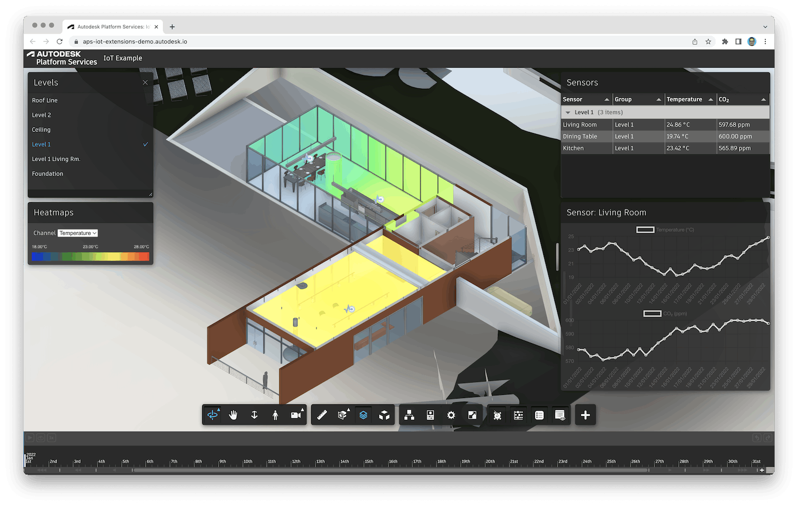

# APS DataViz Extensions Demo (.Net)

Sample [Autodesk Platform Services](https://aps.autodesk.com) application with a set of custom viewer extensions (built on top of the [Data Visualization Extensions](https://aps.autodesk.com/en/docs/dataviz/v1/developers_guide/introduction)) used to display historical IoT data in a BIM model.

Live demo: https://aps-iot-extensions-demo.autodesk.io

## Setup

### Prerequisites

- [APS credentials](https://aps.autodesk.com/en/docs/oauth/v2/tutorials/create-app)
- Terminal (for example, [Windows Command Prompt](https://en.wikipedia.org/wiki/Cmd.exe) or [macOS Terminal](https://support.apple.com/guide/terminal/welcome/mac))

### Running locally

- Clone this repository
- Install dependencies: `dotnet restore`
- Setup environment variables:
    - `APS_CLIENT_ID` - client ID of your APS application
    - `APS_CLIENT_SECRET` - client secret of your APS application
- In [wwwroot/index.js](./wwwroot/index.js), modify `APS_MODEL_URN` and `APS_MODEL_VIEW`
with your own model URN and view GUID
- In [db.json](db.json), modify the mocked up sensors,
for example, changing their `location` (XYZ position in the model's coordinate system)
or `objectId` (the dbID of the room the sensor should be associated with)

        > Note: the locations and object IDs in the mocked up data is setup specifically for the _rac\_basic\_sample\_project.rvt_ sample project from [Revit Sample Project Files](https://knowledge.autodesk.com/support/revit/getting-started/caas/CloudHelp/cloudhelp/2022/ENU/Revit-GetStarted/files/GUID-61EF2F22-3A1F-4317-B925-1E85F138BE88-htm.html).

    - Adjust the resolution and ranges of the randomly generated sensor data

- In [Libs/Utility.cs](./Libs/Utility.cs), adjust the resolution and ranges
of the randomly generated sensor data
- Run the app: `dotnet run --urls http://localhost:3000`
- Go to http://localhost:3000

> When using [Visual Studio Code](https://code.visualstudio.com), you can specify the env. variables listed above in a _.env_ file in this folder, and run & debug the application directly from the editor.

## License

This sample is licensed under the terms of the [MIT License](http://opensource.org/licenses/MIT).
Please see the [LICENSE](LICENSE) file for more details.

## Written by

Eason Kang [@yiskang](https://twitter.com/yiskang), [Developer Advocacy and Support](http://aps.autodesk.com)

Petr Broz [@ipetrbroz](https://twitter.com/ipetrbroz), [Developer Advocacy and Support](http://aps.autodesk.com)